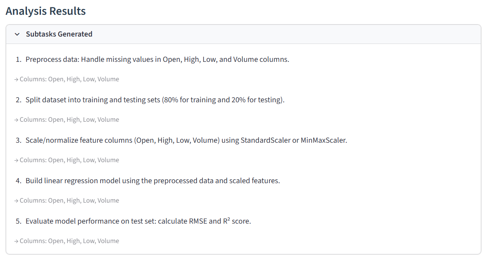
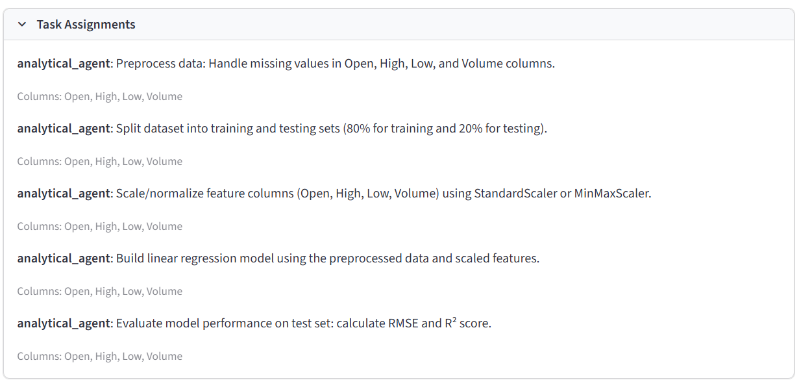
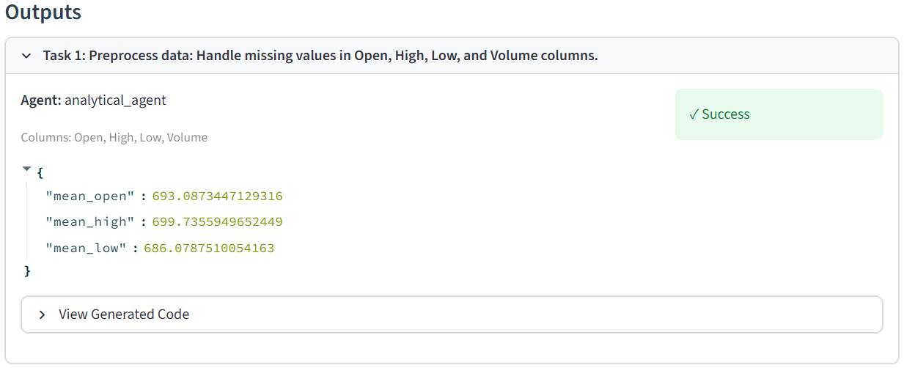
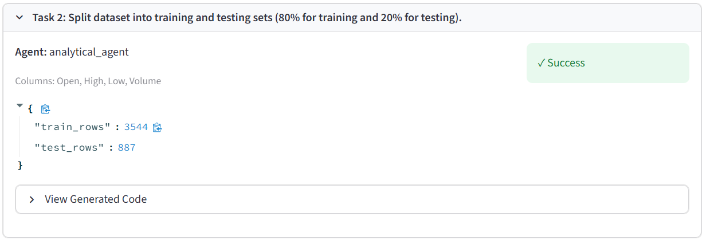
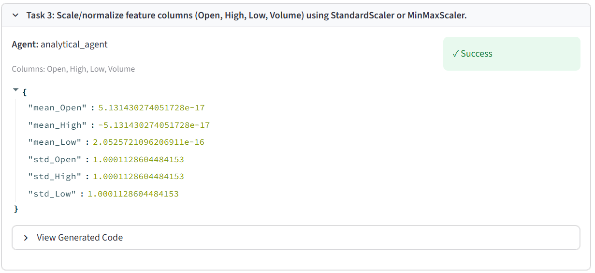
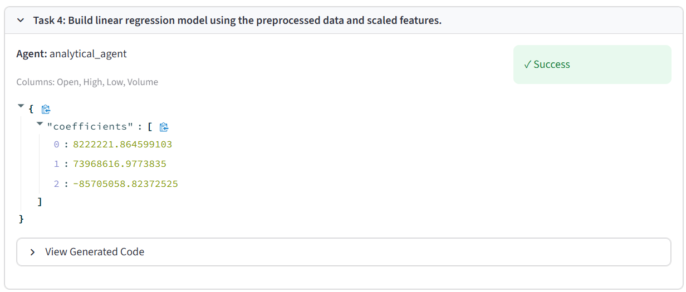

## Solution Walkthrough

### Planner Agent
The Planner Agent decomposes the natural language problem statement into an ordered sequence of pipeline subtasks, each enriched with metadata specifying its ML step  type and the context keys it must read and write. For this query, five subtasks are generated: handling missing values, splitting the data, normalising features, training the model, and computing evaluation metrics.

### Analyzer Agent
The Analyzer Agent routes each subtask to the appropriate execution agent based on its output type. Since this problem involves no visualization, all five tasks are dispatched to the Analytical Agent.

### Analytical Agent
The Analytical Agent generates a `solution(df, context)` function for each subtask, executing them sequentially and propagating outputs through a shared context dictionary. Missing values are handled via median imputation; the data is split 80:20; features are standardised; the model is trained and its coefficients written to context; finally, the evaluation task reads the model and held-out test data from context and reports RMSE and R².

